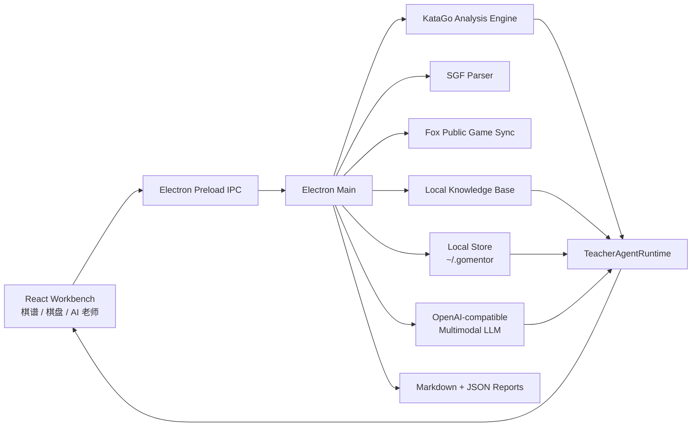

<p align="center">
  
</p>

<h1 align="center">GoMentor</h1>

<p align="center">
  <strong>像 AI 编辑器一样工作的围棋老师。</strong><br />
  KataGo 负责事实判断，多模态 LLM 负责讲清楚，学生画像负责长期进步。
</p>

<p align="center">
  <a href="https://github.com/wimi321/GoMentor/releases"></a>
  <a href="https://github.com/wimi321/GoMentor/releases"></a>
  <a href="https://github.com/wimi321/GoMentor/stargazers"></a>
  <a href="https://github.com/wimi321/GoMentor/actions/workflows/ci.yml"></a>
  <a href="./LICENSE"></a>
  <a href="#社区"></a>
</p>

<p align="center">
  <a href="./README.md">中文</a> |
  <a href="./README_EN.md">English</a> |
  <a href="./README_JA.md">日本語</a> |
  <a href="./README_KO.md">한국어</a> |
  <a href="./README_TH.md">ไทย</a> |
  <a href="./README_VI.md">Tiếng Việt</a>
</p>

<p align="center">
  <strong>加入 GoMentor 交流群：QQ 1030632742</strong><br />
  欢迎交流使用体验、提交建议、反馈 bug，一起把 AI 围棋老师打磨好。
</p>

---

GoMentor 是一个本地优先、跨平台的桌面围棋学习工作台。它不是把聊天框放在棋盘旁边，而是把 KataGo、棋盘截图、本地知识库、学生长期画像和多模态 LLM 组织成一个会执行任务的 AI 围棋老师。

你可以直接说：

- “分析当前手为什么亏。”
- “复盘整盘棋，找出胜负转折点。”
- “分析这个棋手最近 10 局，找出最常见的问题。”
- “根据最近的弱点做一周训练计划。”

KataGo 是事实裁判，LLM 是讲棋老师。GoMentor 的目标是让学生不仅知道哪一步不好，还能理解为什么不好，以及下一周该怎么练。

## 下载

当前公开测试版：

[GoMentor v0.2.0-beta.1](https://github.com/wimi321/GoMentor/releases/tag/v0.2.0-beta.1)

| 平台 | 下载 |
| --- | --- |
| macOS Apple Silicon | [GoMentor-0.2.0-beta.1-mac-arm64.dmg](https://github.com/wimi321/GoMentor/releases/download/v0.2.0-beta.1/GoMentor-0.2.0-beta.1-mac-arm64.dmg) |
| macOS Intel | [GoMentor-0.2.0-beta.1-mac-x64.dmg](https://github.com/wimi321/GoMentor/releases/download/v0.2.0-beta.1/GoMentor-0.2.0-beta.1-mac-x64.dmg) |
| Windows x64 免安装版 | [GoMentor-0.2.0-beta.1-win-x64-portable.exe](https://github.com/wimi321/GoMentor/releases/download/v0.2.0-beta.1/GoMentor-0.2.0-beta.1-win-x64-portable.exe) |
| Windows x64 安装版 | [GoMentor-0.2.0-beta.1-win-x64.exe](https://github.com/wimi321/GoMentor/releases/download/v0.2.0-beta.1/GoMentor-0.2.0-beta.1-win-x64.exe) |

Beta 说明：

- macOS 包目前未完成 Developer ID 签名和公证，首次打开可能出现 Gatekeeper 提示。
- Windows 包目前未签名，可能出现 SmartScreen 提示。
- Windows ARM64 暂不支持。
- 大型 KataGo 二进制和模型不会作为普通 Git 文件提交。

## 你会得到什么

### 专业围棋工作台

- 左侧：棋手、野狐公开棋谱、SGF 导入和棋谱列表。
- 中间：KTrain / Lizzie 风格棋盘、坐标、落子、推荐点、实战点、变化图预览和胜率走势。
- 右侧：类似 AI 编辑器的老师对话区，支持自然语言任务、工具调用日志和流式讲解。

### 类 Lizzie 的分析体验

- 加载棋谱后默认自动开始 KataGo 分析。
- 在胜率图或关键手上切换手数后，默认继续分析当前局面。
- 只有用户主动点击暂停，分析才保持停止。
- 推荐点显示选点序号、胜率、目差、搜索数。
- 实战下一手会和 KataGo 推荐点一起对照，问题手按胜率/目差损失判断。
- 鼠标悬停推荐点时展示后续变化，帮助学生理解“AI 为什么这样下”。

### AI 老师是智能体

老师不是固定模板回复。它可以根据任务调用工具：

- `library.findGames`：按棋手、来源、日期、最近 N 局筛选棋谱。
- `sgf.readGameRecord`：读取 SGF 主线、棋局信息和当前手。
- `katago.analyzePosition`：分析当前局面。
- `katago.analyzeGameBatch`：批量分析一盘或多盘棋。
- `board.captureTeachingImage`：生成带坐标、最后一手和推荐点的棋盘截图。
- `knowledge.searchLocal`：检索本地围棋知识卡。
- `studentProfile.read/write`：读写长期学生画像。
- `report.saveAnalysis`：保存当前手、整盘、多盘和训练计划报告。

### 多模态讲棋

当前手分析会把这些信息组合给用户配置的多模态 LLM：

- 当前棋盘截图。
- KataGo JSON 分析数据。
- 当前手、候选点、实战点、胜率/目差变化。
- 本地知识库中检索到的 2 到 4 张教学卡。
- 棋手画像和最近常见问题。

LLM 负责把这些事实讲成人能听懂、能执行的复盘建议。

## 项目状态

GoMentor 目前处于早期公开 Beta：

- 已打通三栏桌面工作台。
- 已支持野狐公开棋谱同步和本地 SGF 导入。
- 已接入 KataGo 当前手、整盘和多盘分析链路。
- 已支持 OpenAI-compatible 多模态 LLM 配置。
- 已加入本地知识库、学生画像、诊断页和 release readiness 检查。
- 正在继续打磨 UI、签名/公证、自动更新和多语言 UI。

## 架构



关键目录：

```text
src/main            Electron 主进程、IPC、KataGo、野狐同步、老师智能体
src/preload         Renderer 可用的安全桥接 API
src/renderer        React 三栏桌面工作台
data/knowledge      本地围棋知识库
data/katago         KataGo 二进制和权重布局说明
scripts             资产检查、批量复盘、视觉 QA、release 辅助脚本
docs                架构、发布、签名、公证、QA 文档
```

## 本地开发

要求：

- Node.js 22+
- pnpm 10+
- Python 3.10+
- KataGo 二进制和一个 KataGo 模型
- 可选：OpenAI-compatible 多模态 LLM API

启动：

```bash
pnpm install
python3 -m pip install -r scripts/requirements.txt
pnpm dev
```

检查：

```bash
pnpm typecheck
pnpm test
pnpm build
pnpm check
```

打包：

```bash
pnpm dist:mac
pnpm dist:win
pnpm dist:linux
```

## KataGo 资源

GoMentor 优先寻找随安装包携带的 KataGo 运行时：

```text
data/katago/
  bin/<platform>-<arch>/katago
  models/kata1-b18c384nbt-s9996604416-d4316597426.bin.gz
  models/kata1-zhizi-b28c512nbt-muonfd2.bin.gz
```

大型 KataGo binary/model 不作为普通 Git 文件提交。请阅读 [data/katago/README.md](./data/katago/README.md) 和 [docs/KATAGO_ASSETS.md](./docs/KATAGO_ASSETS.md)。

## 隐私与安全

- 棋谱、学生画像、报告和设置默认保存在 `~/.gomentor`。
- LLM API Key 在支持的平台上使用 Electron `safeStorage` 加密保存。
- 前端不会拿到已保存的完整 API Key。
- 当前手讲解会发送棋盘截图、KataGo JSON 和知识库摘录到用户配置的 LLM 服务。
- Web 搜索只用于泛化围棋概念，不发送学生姓名、棋谱原文、截图、API Key 或本机路径。

## 社区

欢迎加入 QQ 群交流、提建议、一起完善：

```text
1030632742
```

你也可以通过 [Issues](https://github.com/wimi321/GoMentor/issues) 提交 bug、产品建议、UI 建议、模型配置经验和复盘样例。

## 路线图

- [x] 三栏桌面工作台。
- [x] 野狐公开棋谱同步和 SGF 导入。
- [x] KataGo 当前手、整盘、多盘分析。
- [x] 推荐点、实战点、变化图预览和胜率走势。
- [x] 多模态 AI 老师、流式回复、本地知识库和学生画像。
- [x] macOS / Windows Beta 安装包。
- [ ] macOS Developer ID 签名和公证。
- [ ] Windows 代码签名。
- [ ] 自动更新。
- [ ] 更完整的训练计划、题库系统和多语言 UI。

## 致谢

- [KataGo](https://github.com/lightvector/KataGo)
- [katagotraining.org](https://katagotraining.org/)
- [Electron](https://www.electronjs.org/)
- [React](https://react.dev/)
- Lizzie / LizzieYZY / KTrain 等专业围棋分析软件带来的交互启发

## License

MIT. See [LICENSE](./LICENSE).
