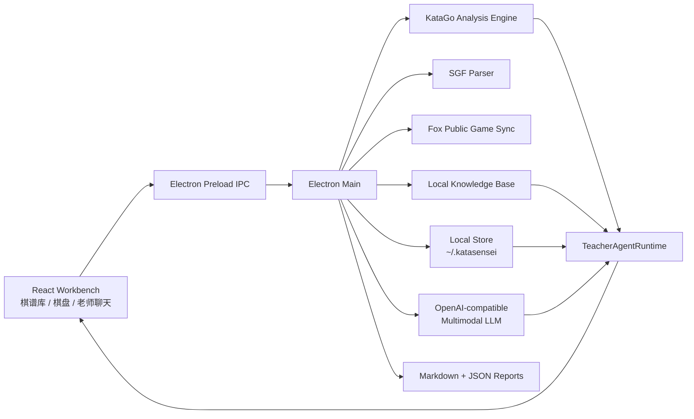

<p align="center">
  
</p>

# KataSensei

> 像 Cursor / Claude Code 一样会调用工具的 AI 围棋老师。KataGo 负责事实判断，多模态 LLM 负责教学表达，学生画像负责长期进步。

[](https://github.com/wimi321/katasensei/actions/workflows/ci.yml)
[](https://github.com/wimi321/katasensei/actions/workflows/release.yml)
[](./LICENSE)

KataSensei 是一个本地优先的跨平台桌面应用，目标不是再做一个普通复盘工具，而是做一个能长期陪学生学围棋的智能体老师：

- 左侧同步和管理野狐 / SGF 棋谱。
- 中间是 KTrain / Lizzie 风格棋盘与整盘胜率图。
- 右侧是会规划、会调用 KataGo、会查知识库、会写报告的 AI 围棋老师。
- 老师可以直接执行“分析当前手”“分析整盘围棋”“分析近 10 局围棋”“给学生做训练计划”等自然语言任务。

KataGo 的结构化分析永远是事实裁判；LLM 只负责把事实讲成学生听得懂、能执行的训练建议。

## English

English documentation is available in [README_EN.md](./README_EN.md).

## 当前状态

KataSensei 处于早期公开版本阶段。核心工作台、野狐同步、SGF 主线解析、KataGo 分析、快速胜率图、右侧老师智能体、多模态 LLM 配置、本地知识库和学生画像已经打通。

仍在演进中的部分：

- 正式发布包的签名、公证和自动更新。
- 更完整的 KataGo 权重下载器和校验器。
- 更丰富的报告模板和训练题库。
- 多语言 UI。

## 核心能力

### 三栏围棋学习工作台

- 左侧：输入野狐昵称 / UID，同步公开棋谱；支持分页浏览；支持上传本地 SGF。
- 中间：大棋盘、黑白双方、当前手、推荐点、整盘胜率图、关键问题手误差柱。
- 右侧：AI 围棋老师聊天区，展示工具调用日志、讲解和报告。

### 老师是智能体，不是固定按钮

右侧老师拥有工具目录，可以根据任务自己选择链路：

- `library.findGames`：按学生、来源、日期、最近 N 盘筛选棋谱。
- `sgf.readGameRecord`：读取 SGF 主线、棋局元信息和当前手。
- `katago.analyzePosition`：分析当前局面。
- `katago.analyzeGameBatch`：批量分析一盘或多盘棋。
- `board.captureTeachingImage`：生成带坐标、最后一手和推荐点的棋盘截图。
- `knowledge.searchLocal`：检索随应用打包的围棋知识库。
- `studentProfile.read/write`：读写长期学生画像。
- `report.saveAnalysis`：保存当前手、整盘、多盘和训练计划报告。
- `web.searchGoKnowledge`：在用户需要外部资料时做泛化搜索，不发送隐私棋谱。

### 快捷复盘

顶部快捷按钮：

- `分析当前手`：截图棋盘，KataGo 分析当前手，结合知识库和多模态 LLM 讲解。
- `分析整盘围棋`：分析当前整盘棋，提取关键问题手和胜负转折点。
- `分析近10局围棋`：筛选学生最近 10 盘，批量提取常见问题，更新学生画像。

### LLM 配置

设置入口在右侧老师栏齿轮中：

- OpenAI-compatible Base URL。
- API Key。
- 多模态模型名称。

KataSensei 只面向支持图片输入的多模态模型。当前手分析会把棋盘截图、KataGo JSON 和知识库片段一起发给配置的 LLM。

### KataGo 运行方式

应用优先寻找随包携带的 KataGo 运行时：

```text
data/katago/
  bin/<platform>-<arch>/katago
  models/kata1-b18c384nbt-s9996604416-d4316597426.bin.gz
  models/kata1-zhizi-b28c512nbt-muonfd2.bin.gz
```

开发模式下也会回退使用本机 `katago` 和 `~/.katago/models/latest-kata1.bin.gz`。大型模型和平台二进制不会提交到 Git，请按 [data/katago/README.md](./data/katago/README.md) 放置。

内置权重预设：

- `推荐通用 b18`：默认推荐，速度和强度平衡，适合日常教学和快速胜率图。
- `强力精读 b28`：更适合关键局面精读，资源占用更高。

## 架构



关键目录：

```text
src/main            Electron 主进程、IPC、KataGo、野狐同步、老师智能体
src/preload         Renderer 可用的安全桥接 API
src/renderer        React 三栏工作台
data/knowledge      本地围棋知识库
data/katago         可选内置 KataGo 二进制和权重布局说明
scripts             批量复盘、KataGo 准备、开发辅助脚本
docs                架构和老师智能体设计
```

## 快速开始

### 要求

- Node.js 22+
- pnpm 10+
- Python 3.10+，用于批量 SGF/KataGo 复盘脚本
- KataGo 二进制和一个 KataGo 模型
- 可选：OpenAI-compatible 多模态 LLM API

### 安装依赖

```bash
pnpm install
python3 -m pip install -r scripts/requirements.txt
```

### 启动开发版

```bash
pnpm dev
```

### 检查

```bash
pnpm typecheck
pnpm build
```

## 打包

```bash
pnpm dist:mac
pnpm dist:win
pnpm dist:linux
```

输出目录：

```text
release/<version>/
```

发布标签会触发 GitHub Actions，分别在 macOS、Windows、Linux runner 上构建安装包，并把产物上传到 GitHub Release：

```bash
git tag v0.2.0-beta.1
git push origin v0.2.0-beta.1
```

P0 beta 首发支持 macOS arm64/x64 和 Windows x64。Windows ARM64 暂不支持。

注意：公开发布前，还需要完成 macOS 签名/公证、Windows 代码签名、Windows 真机 smoke、视觉 QA evidence 和自动更新策略。

## 隐私与安全

- 棋谱库、学生画像和报告默认保存在 `~/.katasensei`。
- LLM API Key 在支持的平台上使用 Electron `safeStorage` 加密保存。
- 前端永远拿不到已保存的完整 API Key。
- 当前手讲解会发送棋盘截图、KataGo JSON、知识库摘录到用户配置的 LLM 服务。
- 批量分析默认只做本地 KataGo，最后再把聚合结果交给 LLM 总结。
- Web 搜索只允许泛化围棋概念，不发送学生姓名、棋谱原文、截图、API Key 或本机路径。

## 开发规范

提交前请至少运行：

```bash
pnpm typecheck
pnpm build
```

推荐阅读：

- [docs/ARCHITECTURE.md](./docs/ARCHITECTURE.md)
- [docs/TEACHER_AGENT.md](./docs/TEACHER_AGENT.md)
- [CONTRIBUTING.md](./CONTRIBUTING.md)
- [SECURITY.md](./SECURITY.md)

## 路线图

- [x] 三栏工作台：棋谱库、棋盘、老师聊天。
- [x] 野狐公开棋谱同步和 SGF 上传。
- [x] KataGo 当前手分析。
- [x] 加载棋谱后快速生成胜率图。
- [x] 当前手、整盘、最近 10 局快捷智能体任务。
- [x] 本地知识库检索。
- [x] 学生画像读写。
- [x] macOS / Windows / Linux CI 和 Release workflow。
- [ ] 官方安装包签名与公证。
- [ ] 内置 KataGo 下载器、模型校验和版本管理。
- [ ] 更完整的训练计划和题库系统。
- [ ] 插件化老师工具注册表。

## 致谢

- [KataGo](https://github.com/lightvector/KataGo)
- [katagotraining.org](https://katagotraining.org/)
- [Electron](https://www.electronjs.org/)
- [React](https://react.dev/)
- 本地项目 `YiGo`、`LizzieYZY`、`KTrain` 风格参考

## License

MIT. See [LICENSE](./LICENSE).
