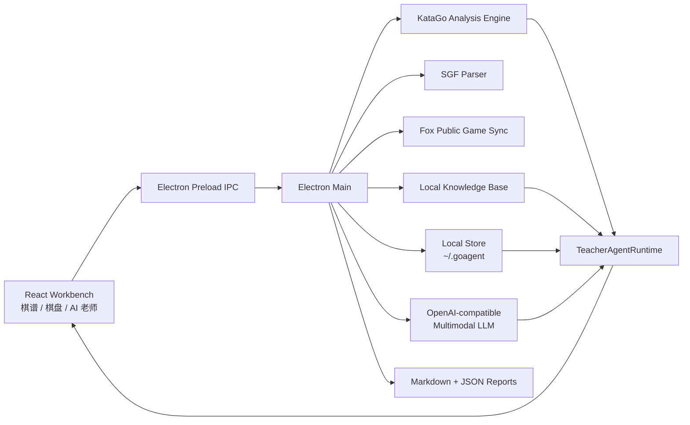

<p align="center">
  
</p>

<h1 align="center">GoAgent · 围棋智能体</h1>

<p align="center">
  <strong>目标是打造全球领先的围棋智能体。</strong><br />
  KataGo 负责事实判断，多模态 LLM 负责讲清楚，学生画像负责长期进步。
</p>

<p align="center">
  <a href="https://github.com/wimi321/GoAgent/releases"></a>
  <a href="https://github.com/wimi321/GoAgent/releases"></a>
  <a href="https://github.com/wimi321/GoAgent/stargazers"></a>
  <a href="https://github.com/wimi321/GoAgent/actions/workflows/ci.yml"></a>
  <a href="./LICENSE"></a>
  <a href="#社区"></a>
</p>

<p align="center">
  <a href="./README.md">中文</a> |
  <a href="./README_EN.md">English</a> |
  <a href="./README_JA.md">日本語</a> |
  <a href="./README_KO.md">한국어</a> |
  <a href="./README_TH.md">ไทย</a> |
  <a href="./README_VI.md">Tiếng Việt</a>
</p>

<p align="center">
  <strong>加入 GoAgent 交流群：QQ 1030632742</strong><br />
  欢迎交流使用体验、提交建议、反馈 bug，一起把围棋智能体打磨好。
</p>

---

GoAgent · 围棋智能体是一个本地优先、跨平台的桌面围棋学习工作台。它不是把聊天框放在棋盘旁边，而是把 KataGo、棋盘截图、本地知识库、学生长期画像和多模态 LLM 组织成一个会执行任务的围棋智能体。

你可以直接说：

- “分析当前手为什么亏。”
- “复盘整盘棋，找出胜负转折点。”
- “分析这个棋手最近 10 局，找出最常见的问题。”
- “根据最近的弱点做一周训练计划。”

KataGo 是事实裁判，LLM 是讲棋老师。GoAgent 的目标是让学生不仅知道哪一步不好，还能理解为什么不好，以及下一周该怎么练。

## 下载

当前发布版本：

[GoAgent v0.4.21](https://github.com/wimi321/GoAgent/releases/tag/v0.4.21)

| 平台 | 下载 |
| --- | --- |
| macOS Apple Silicon | [GoAgent-0.4.21-mac-arm64.dmg](https://github.com/wimi321/GoAgent/releases/download/v0.4.21/GoAgent-0.4.21-mac-arm64.dmg) |
| macOS Intel | [GoAgent-0.4.21-mac-x64.dmg](https://github.com/wimi321/GoAgent/releases/download/v0.4.21/GoAgent-0.4.21-mac-x64.dmg) |
| Windows x64 标准版免安装 ZIP | [GoAgent-0.4.21-win-x64-portable.zip](https://github.com/wimi321/GoAgent/releases/download/v0.4.21/GoAgent-0.4.21-win-x64-portable.zip) |
| Windows x64 标准版安装包 | [GoAgent-0.4.21-win-x64.exe](https://github.com/wimi321/GoAgent/releases/download/v0.4.21/GoAgent-0.4.21-win-x64.exe) |
| Windows x64 NVIDIA 免安装 7z | [GoAgent-0.4.21-win-x64-nvidia-portable.7z](https://github.com/wimi321/GoAgent/releases/download/v0.4.21/GoAgent-0.4.21-win-x64-nvidia-portable.7z) |
| Windows x64 NVIDIA 安装包 | [GoAgent-0.4.21-win-x64-nvidia.exe](https://github.com/wimi321/GoAgent/releases/download/v0.4.21/GoAgent-0.4.21-win-x64-nvidia.exe) |

发布说明：

- macOS 应用已使用 Apple Developer ID 签名、通过 Apple notarization，并附带 stapled ticket；发布流程会在上传前执行代码签名、Gatekeeper、公证票据和 DMG 完整性检查。
- Windows 包目前未签名，可能出现 SmartScreen 提示。
- Windows ARM64 暂不支持。
- 大型 KataGo 二进制和模型不会作为普通 Git 文件提交。

## 你会得到什么

### 专业围棋工作台

- 左侧：棋手、野狐公开棋谱、SGF 导入和棋谱列表。
- 中间：KTrain / Lizzie 风格棋盘、坐标、落子、推荐点、实战点、变化图预览和胜率走势。
- 右侧：类似 AI 编辑器的老师对话区，支持自然语言任务、工具调用日志和流式讲解。

### 类 Lizzie 的分析体验

- 加载棋谱后默认自动开始 KataGo 分析。
- 在胜率图或关键手上切换手数后，默认继续分析当前局面。
- 只有用户主动点击暂停，分析才保持停止。
- 推荐点显示选点序号、胜率、目差、搜索数。
- 实战下一手会和 KataGo 推荐点一起对照，问题手按胜率/目差损失判断。
- 鼠标悬停推荐点时展示后续变化，帮助学生理解“AI 为什么这样下”。
- 本机速度慢时，可在设置里接入自己的 iKataGo 远程算力客户端。

### AI 老师是智能体

老师不是固定模板回复。它可以根据任务调用工具：

- `library.findGames`：按棋手、来源、日期、最近 N 局筛选棋谱。
- `sgf.readGameRecord`：读取 SGF 主线、棋局信息和当前手。
- `katago.analyzePosition`：分析当前局面。
- `katago.analyzeGameBatch`：批量分析一盘或多盘棋。
- `board.captureTeachingImage`：生成带坐标、最后一手和推荐点的棋盘截图。
- `knowledge.searchLocal`：检索本地围棋知识卡。
- `studentProfile.read/write`：读写长期学生画像。
- `report.saveAnalysis`：保存当前手、整盘、多盘和训练计划报告。

### 多模态讲棋

当前手分析会把这些信息组合给用户配置的多模态 LLM：

- 当前棋盘截图。
- KataGo JSON 分析数据。
- 当前手、候选点、实战点、胜率/目差变化。
- 本地知识库中检索到的 2 到 4 张教学卡。
- 棋手画像和最近常见问题。

LLM 负责把这些事实讲成人能听懂、能执行的复盘建议。

### 内置定式与棋形知识

- 内置高频定式、棋形、手筋和死活型教学卡。
- 本地识别角部定式、局部棋形和常见问题手类型。
- 老师讲棋时会引用匹配到的知识，但仍以 KataGo 当前局面判断为准。
- 匹配不够强时会明确说“类似某个棋形”，避免机械套定式。

## 项目状态

GoAgent 目前处于公开发布早期：

- 已打通三栏桌面工作台。
- 已支持野狐公开棋谱同步和本地 SGF 导入。
- 已接入 KataGo 当前手、整盘和多盘分析链路。
- 已支持 OpenAI-compatible 多模态 LLM 配置。
- 已加入本地知识库、学生画像、诊断页和 release readiness 检查。
- 已加入定式数据库、棋形识别、讲棋证据校验和多语言 UI 入口。
- 已完成 macOS Developer ID 签名与 Apple 公证；继续打磨自动更新、更多语言文本和真实教练验收。

## 架构


```mermaid
flowchart LR
  UI["React Workbench\n棋谱 / 棋盘 / AI 老师"] --> IPC["Electron Preload IPC"]
  IPC --> Main["Electron Main"]
  Main --> Store["Local Store\n~/.goagent"]
  Main --> SGF["SGF Parser"]
  Main --> Fox["Fox Public Game Sync"]
  Main --> KataGo["KataGo Analysis Engine"]
  Main --> KB["Local Knowledge Base"]
  Main --> LLM["OpenAI-compatible\nMultimodal LLM"]
  Main --> Reports["Markdown + JSON Reports"]
  KataGo --> Agent["TeacherAgentRuntime"]
  KB --> Agent
  Store --> Agent
  LLM --> Agent
  Agent --> UI
```

关键目录：

```text
src/main            Electron 主进程、IPC、KataGo、野狐同步、老师智能体
src/preload         Renderer 可用的安全桥接 API
src/renderer        React 三栏桌面工作台
data/knowledge      本地围棋知识库
data/katago         KataGo 二进制和权重布局说明
scripts             资产检查、批量复盘、视觉 QA、release 辅助脚本
docs                架构、发布、签名、公证、QA 文档
```

## 本地开发

要求：

- Node.js 22+
- pnpm 10+
- Python 3.10+
- KataGo 二进制和一个 KataGo 模型
- 可选：OpenAI-compatible 多模态 LLM API，或通过官方 Codex App Server 使用 ChatGPT 登录

启动：

```bash
pnpm install
python3 -m pip install -r scripts/requirements.txt
pnpm dev
```

检查：

```bash
pnpm typecheck
pnpm test
pnpm build
pnpm check
```

打包：

```bash
pnpm dist:mac
pnpm dist:win
pnpm dist:linux
```

## AI 老师连接

- **API Key**：可继续使用支持 OpenAI-compatible API 的多模态模型服务。
- **ChatGPT 登录**：在“设置 → AI 老师”选择“使用 ChatGPT 登录”。GoAgent 通过官方 Codex App Server 完成登录、模型发现和请求；可使用当前 ChatGPT 套餐中支持棋盘图片输入的模型。
- 登录型连接使用 GoAgent 独立的 Codex App Server 数据目录，不读取或修改系统 Codex CLI / Codex Desktop 的登录；GoAgent 业务代码不读取、复制或输出 OAuth token。

## KataGo 资源

GoAgent 优先寻找随安装包携带的 KataGo 运行时：

```text
data/katago/
  bin/<platform>-<arch>/katago
  models/kata1-b18c384nbt-s9996604416-d4316597426.bin.gz
  models/kata1-zhizi-b28c512nbt-muonfd2.bin.gz
```

大型 KataGo binary/model 不作为普通 Git 文件提交。请阅读 [data/katago/README.md](./data/katago/README.md) 和 [docs/KATAGO_ASSETS.md](./docs/KATAGO_ASSETS.md)。

如果本机算力不够，可以配置 [iKataGo Remote Engine](./docs/IKATAGO_REMOTE_ENGINE.md) 或 [智子云远程算力](./docs/ZHIZI_CLOUD_ENGINE.md)。iKataGo 通过本地 `ikatago-client -- analysis` 连接你自己的远程 GPU 服务；智子云通过 `zz-ikatago` 的 GTP / `kata-analyze` 输出接入智子围棋电脑版远程算力。未显式启用远程引擎时，GoAgent 不会把棋局发送到远程。

## 隐私与安全

- 棋谱、学生画像、报告和设置默认保存在 `~/.goagent`。
- LLM API Key 保存在 GoAgent 本地 secret store 中；只有用户主动点击“显示 Key”核对时才会在设置页读取并显示。
- ChatGPT 登录凭据由 GoAgent 内置的官方 Codex App Server 保存在 GoAgent 专属目录中；GoAgent 业务代码不会读取或输出 OAuth token，也不会触碰系统 Codex 登录。
- 当前手讲解会发送棋盘截图、KataGo JSON 和知识库摘录到用户配置的 LLM 服务。
- Web 搜索只用于泛化围棋概念，不发送学生姓名、棋谱原文、截图、API Key 或本机路径。

## 社区

欢迎加入 QQ 群交流、提建议、一起完善：

```text
1030632742
```

你也可以通过 [Issues](https://github.com/wimi321/GoAgent/issues) 提交 bug、产品建议、UI 建议、模型配置经验和复盘样例。

## 路线图

- [x] 三栏桌面工作台。
- [x] 野狐公开棋谱同步和 SGF 导入。
- [x] KataGo 当前手、整盘、多盘分析。
- [x] 推荐点、实战点、变化图预览和胜率走势。
- [x] 多模态 AI 老师、流式回复、本地知识库和学生画像。
- [x] macOS / Windows Beta 安装包。
- [x] macOS Developer ID 签名、Apple 公证和 Gatekeeper 验收。
- [ ] Windows 代码签名。
- [ ] 自动更新。
- [ ] 更完整的训练计划、题库系统和多语言 UI。

## 致谢

- [KataGo](https://github.com/lightvector/KataGo)
- [katagotraining.org](https://katagotraining.org/)
- [Electron](https://www.electronjs.org/)
- [React](https://react.dev/)
- Lizzie / LizzieYZY / KTrain 等专业围棋分析软件带来的交互启发

## License

MIT. See [LICENSE](./LICENSE).
