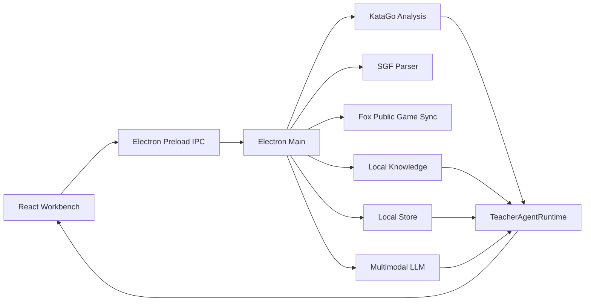

<p align="center">
  
</p>

<h1 align="center">GoMentor</h1>

<p align="center">
  <strong>An AI-editor-style Go teacher for desktop.</strong><br />
  KataGo provides the facts, a multimodal LLM explains the lesson, and student profiles keep coaching consistent over time.
</p>

<p align="center">
  <a href="https://github.com/wimi321/GoMentor/releases"></a>
  <a href="https://github.com/wimi321/GoMentor/releases"></a>
  <a href="https://github.com/wimi321/GoMentor/stargazers"></a>
  <a href="https://github.com/wimi321/GoMentor/actions/workflows/ci.yml"></a>
  <a href="./LICENSE"></a>
  <a href="#community"></a>
</p>

<p align="center">
  <a href="./README.md">中文</a> |
  <a href="./README_EN.md">English</a> |
  <a href="./README_JA.md">日本語</a> |
  <a href="./README_KO.md">한국어</a> |
  <a href="./README_TH.md">ไทย</a> |
  <a href="./README_VI.md">Tiếng Việt</a>
</p>

<p align="center">
  <strong>Join the GoMentor community: QQ 1030632742</strong><br />
  Share feedback, report bugs, and help improve the AI Go teacher together.
</p>

---

GoMentor is a local-first, cross-platform desktop workbench for Go students and teachers. It is not just a chat panel beside a board: it turns KataGo, board screenshots, local knowledge cards, long-term student memory, and a multimodal LLM into an agentic Go teacher.

Ask it to:

- explain the current move,
- review the full game,
- diagnose a player's latest 10 games,
- create a one-week training plan from recurring weaknesses.

KataGo is the source of truth. The LLM is the teacher that turns those facts into clear, actionable coaching.

## Downloads

Current public beta:

[GoMentor v0.2.0-beta.1](https://github.com/wimi321/GoMentor/releases/tag/v0.2.0-beta.1)

| Platform | Download |
| --- | --- |
| macOS Apple Silicon | [GoMentor-0.2.0-beta.1-mac-arm64.dmg](https://github.com/wimi321/GoMentor/releases/download/v0.2.0-beta.1/GoMentor-0.2.0-beta.1-mac-arm64.dmg) |
| macOS Intel | [GoMentor-0.2.0-beta.1-mac-x64.dmg](https://github.com/wimi321/GoMentor/releases/download/v0.2.0-beta.1/GoMentor-0.2.0-beta.1-mac-x64.dmg) |
| Windows x64 portable ZIP | [GoMentor-0.2.0-beta.1-win-x64-portable.zip](https://github.com/wimi321/GoMentor/releases/download/v0.2.0-beta.1/GoMentor-0.2.0-beta.1-win-x64-portable.zip) |
| Windows x64 installer | [GoMentor-0.2.0-beta.1-win-x64.exe](https://github.com/wimi321/GoMentor/releases/download/v0.2.0-beta.1/GoMentor-0.2.0-beta.1-win-x64.exe) |

Beta caveats:

- macOS packages are not yet Developer ID signed or notarized.
- Windows packages are unsigned and may trigger SmartScreen.
- Windows ARM64 is not supported in this beta.
- Large KataGo binaries and models are not committed as normal Git files.

## Highlights

### Professional Go workbench

- Left rail: players, Fox public games, SGF import, and game library.
- Center: KTrain/Lizzie-inspired board, coordinates, stones, candidates, played-move comparison, PV preview, and winrate timeline.
- Right rail: AI-editor-style teacher composer, streamed replies, tool logs, and structured review cards.

### Lizzie-inspired live analysis

- Loading a game starts KataGo analysis automatically.
- Selecting a move on the winrate timeline continues analysis for that position.
- Analysis remains stopped only after the user explicitly clicks pause.
- Candidate points show rank, winrate, score lead, and visits.
- Played moves are compared against KataGo candidates, and problem moves are judged by winrate/score loss.

### Agentic teacher runtime

The teacher can call tools instead of following fixed templates:

- `library.findGames`
- `sgf.readGameRecord`
- `katago.analyzePosition`
- `katago.analyzeGameBatch`
- `board.captureTeachingImage`
- `knowledge.searchLocal`
- `studentProfile.read/write`
- `report.saveAnalysis`

## Architecture



## Development

Requirements:

- Node.js 22+
- pnpm 10+
- Python 3.10+
- KataGo binary and model
- Optional OpenAI-compatible multimodal LLM API

```bash
pnpm install
python3 -m pip install -r scripts/requirements.txt
pnpm dev
```

Checks:

```bash
pnpm typecheck
pnpm test
pnpm build
pnpm check
```

Packaging:

```bash
pnpm dist:mac
pnpm dist:win
pnpm dist:linux
```

## Privacy

- Games, reports, settings, and student profiles stay under `~/.gomentor` by default.
- Saved LLM API keys are encrypted with Electron `safeStorage` when available.
- Current-move teaching may send a board screenshot, KataGo JSON, and selected knowledge cards to the configured LLM endpoint.
- Web search is optional and should only use generic Go concepts.

## Community

Join the QQ group for discussion, feedback, and collaboration:

```text
1030632742
```

Issues and pull requests are welcome.

## License

MIT. See [LICENSE](./LICENSE).
