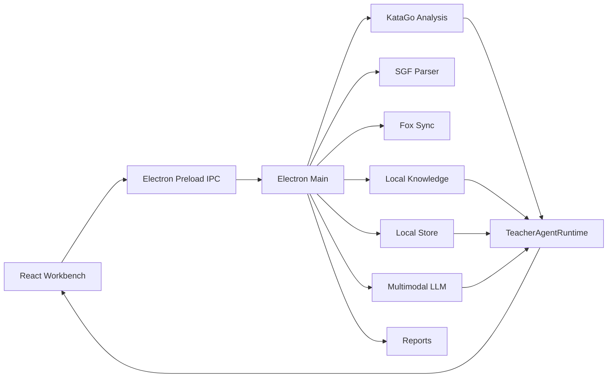

<p align="center">
  
</p>

# KataSensei

> An agentic Go teacher for desktop. KataGo judges the position, a multimodal LLM explains the lesson, and a long-term student profile keeps the coaching consistent.

[](https://github.com/wimi321/katasensei/actions/workflows/ci.yml)
[](https://github.com/wimi321/katasensei/actions/workflows/release.yml)
[](./LICENSE)

KataSensei is a local-first, cross-platform desktop workbench for Go students and teachers.

- Left rail: sync public Fox games, upload SGF, and browse the game library.
- Center: KTrain/Lizzie-inspired board, player info, current move, candidate points, and full-game winrate graph.
- Right rail: an AI Go teacher that can plan tasks, call tools, read local knowledge, run KataGo, and save reports.

The product goal is not "chat beside a board". The teacher is an agent: users can ask for current-move analysis, full-game review, recent-10-game diagnosis, training plans, or open-ended learning tasks.

## Status

KataSensei is an early public project. The core workbench, SGF parsing, Fox sync, KataGo analysis, quick winrate graph, teacher agent, multimodal LLM settings, local knowledge base, and student profile storage are implemented.

Still in progress:

- Signed and notarized public installers.
- A first-class KataGo model downloader and verifier.
- Richer report templates and training problem sets.
- Full UI localization.

## Core Features

- **Agentic teacher runtime**: a tool-using teacher inspired by Claude Code/Cursor workflows.
- **KataGo-first review**: structured KataGo data is the source of truth.
- **Multimodal current-move teaching**: sends board screenshot + KataGo facts + selected knowledge cards to an OpenAI-compatible multimodal model.
- **Full-game and recent-game reviews**: extracts mistakes, updates student profile, and writes Markdown/JSON reports.
- **Local knowledge base**: packaged Go concepts for stable teaching language.
- **Local-first storage**: games, reports, settings, and student profiles live under `~/.katasensei`.
- **Cross-platform desktop**: Electron build targets macOS, Windows, and Linux.

## Architecture



## Requirements

- Node.js 22+
- pnpm 10+
- Python 3.10+
- KataGo binary and model
- Optional OpenAI-compatible multimodal LLM API

## Development

```bash
pnpm install
python3 -m pip install -r scripts/requirements.txt
pnpm dev
```

Verify locally:

```bash
pnpm typecheck
pnpm build
```

## Packaging

```bash
pnpm dist:mac
pnpm dist:win
pnpm dist:linux
```

Release artifacts are written to:

```text
release/<version>/
```

GitHub release builds run on native macOS, Windows, and Linux runners when a `v*.*.*` tag is pushed.

## KataGo Runtime

KataSensei first looks for a bundled runtime:

```text
data/katago/
  bin/<platform>-<arch>/katago
  models/kata1-b18c384nbt-s9996604416-d4316597426.bin.gz
  models/kata1-zhizi-b28c512nbt-muonfd2.bin.gz
```

Large KataGo binaries and model files are intentionally not committed to Git. See [data/katago/README.md](./data/katago/README.md).

## Privacy

- SGFs, reports, settings, and student profiles stay local by default.
- Saved LLM API keys are encrypted through Electron `safeStorage` when available.
- Current-move analysis may send a board screenshot, KataGo JSON, and selected knowledge cards to the configured LLM endpoint.
- Web search is optional and must use generic Go concepts only.

## Contributing

Read [CONTRIBUTING.md](./CONTRIBUTING.md) and [docs/TEACHER_AGENT.md](./docs/TEACHER_AGENT.md) before changing teacher-agent behavior.

## License

MIT. See [LICENSE](./LICENSE).
