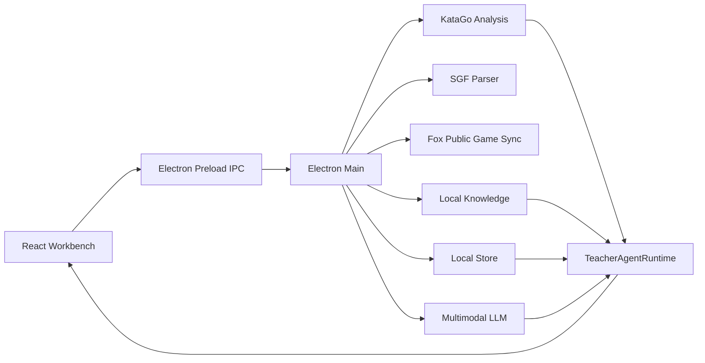

<p align="center">
  
</p>

<h1 align="center">GoAgent · AI Go Agent</h1>

<p align="center">
  <strong>An agentic AI teacher for Go / Weiqi / Baduk.</strong><br />
  KataGo provides the facts, a multimodal LLM explains the lesson, and student profiles keep coaching consistent over time.
</p>

<p align="center">
  <a href="https://github.com/wimi321/GoAgent/releases"></a>
  <a href="https://github.com/wimi321/GoAgent/releases"></a>
  <a href="https://github.com/wimi321/GoAgent/stargazers"></a>
  <a href="https://github.com/wimi321/GoAgent/actions/workflows/ci.yml"></a>
  <a href="./LICENSE"></a>
  <a href="#community"></a>
</p>

<p align="center">
  <a href="./README.md">中文</a> |
  <a href="./README_EN.md">English</a> |
  <a href="./README_JA.md">日本語</a> |
  <a href="./README_KO.md">한국어</a> |
  <a href="./README_TH.md">ไทย</a> |
  <a href="./README_VI.md">Tiếng Việt</a>
</p>

<p align="center">
  <strong>Join the GoAgent community: QQ 1030632742</strong><br />
  Share feedback, report bugs, and help improve the AI Go teacher together.
</p>

---

GoAgent is a local-first, cross-platform desktop workbench and agentic AI teacher for Go / Weiqi / Baduk students and teachers. It is not just a chat panel beside a board: it turns KataGo, board screenshots, local knowledge cards, long-term student memory, and a multimodal LLM into an agentic Go teacher.

Ask it to:

- explain the current move,
- review the full game,
- diagnose a player's latest 10 games,
- create a one-week training plan from recurring weaknesses.

KataGo is the source of truth. The LLM is the teacher that turns those facts into clear, actionable coaching.

## Downloads

Current release:

[GoAgent v0.4.21](https://github.com/wimi321/GoAgent/releases/tag/v0.4.21)

| Platform | Download |
| --- | --- |
| macOS Apple Silicon | [GoAgent-0.4.21-mac-arm64.dmg](https://github.com/wimi321/GoAgent/releases/download/v0.4.21/GoAgent-0.4.21-mac-arm64.dmg) |
| macOS Intel | [GoAgent-0.4.21-mac-x64.dmg](https://github.com/wimi321/GoAgent/releases/download/v0.4.21/GoAgent-0.4.21-mac-x64.dmg) |
| Windows x64 Standard portable ZIP | [GoAgent-0.4.21-win-x64-portable.zip](https://github.com/wimi321/GoAgent/releases/download/v0.4.21/GoAgent-0.4.21-win-x64-portable.zip) |
| Windows x64 Standard installer | [GoAgent-0.4.21-win-x64.exe](https://github.com/wimi321/GoAgent/releases/download/v0.4.21/GoAgent-0.4.21-win-x64.exe) |
| Windows x64 NVIDIA portable 7z | [GoAgent-0.4.21-win-x64-nvidia-portable.7z](https://github.com/wimi321/GoAgent/releases/download/v0.4.21/GoAgent-0.4.21-win-x64-nvidia-portable.7z) |
| Windows x64 NVIDIA installer | [GoAgent-0.4.21-win-x64-nvidia.exe](https://github.com/wimi321/GoAgent/releases/download/v0.4.21/GoAgent-0.4.21-win-x64-nvidia.exe) |

Release caveats:

- macOS apps are Developer ID signed, Apple-notarized, and distributed with a stapled ticket. CI verifies the signature, Gatekeeper acceptance, ticket, and DMG integrity before upload.
- Windows packages are unsigned and may trigger SmartScreen.
- Windows ARM64 is not supported in this beta.
- Large KataGo binaries and models are not committed as normal Git files.

## Highlights

### Professional Go workbench

- Left rail: players, Fox public games, SGF import, and game library.
- Center: KTrain/Lizzie-inspired board, coordinates, stones, candidates, played-move comparison, PV preview, and winrate timeline.
- Right rail: AI-editor-style teacher composer, streamed replies, tool logs, and structured review cards.

### Lizzie-inspired live analysis

- Loading a game starts KataGo analysis automatically.
- Selecting a move on the winrate timeline continues analysis for that position.
- Analysis remains stopped only after the user explicitly clicks pause.
- Candidate points show rank, winrate, score lead, and visits.
- Played moves are compared against KataGo candidates, and problem moves are judged by winrate/score loss.
- Slow local machines can connect to a user-owned iKataGo remote compute client from Settings.

### Agentic teacher runtime

The teacher can call tools instead of following fixed templates:

- `library.findGames`
- `sgf.readGameRecord`
- `katago.analyzePosition`
- `katago.analyzeGameBatch`
- `board.captureTeachingImage`
- `knowledge.searchLocal`
- `studentProfile.read/write`
- `report.saveAnalysis`

## Architecture


```mermaid
flowchart LR
  UI["React Workbench"] --> IPC["Electron Preload IPC"]
  IPC --> Main["Electron Main"]
  Main --> Store["Local Store"]
  Main --> SGF["SGF Parser"]
  Main --> Fox["Fox Public Game Sync"]
  Main --> KataGo["KataGo Analysis"]
  Main --> KB["Local Knowledge"]
  Main --> LLM["Multimodal LLM"]
  KataGo --> Agent["TeacherAgentRuntime"]
  KB --> Agent
  Store --> Agent
  LLM --> Agent
  Agent --> UI
```

## Development

Requirements:

- Node.js 22+
- pnpm 10+
- Python 3.10+
- KataGo binary and model
- Optional OpenAI-compatible multimodal LLM API, or ChatGPT sign-in through the official Codex App Server

For remote compute, see [iKataGo Remote Engine](./docs/IKATAGO_REMOTE_ENGINE.md). GoAgent uses a local `ikatago-client -- analysis` process and does not send positions remotely unless the user explicitly enables that engine path.

```bash
pnpm install
python3 -m pip install -r scripts/requirements.txt
pnpm dev
```

Checks:

```bash
pnpm typecheck
pnpm test
pnpm build
pnpm check
```

Packaging:

```bash
pnpm dist:mac
pnpm dist:win
pnpm dist:linux
```

## AI Teacher Connections

- **API key**: Continue using any OpenAI-compatible multimodal model service.
- **ChatGPT sign-in**: Choose “Sign in with ChatGPT” under **Settings → AI Teacher**. GoAgent uses the official Codex App Server for sign-in, model discovery, and requests, and can use models in the active ChatGPT plan that accept board images.
- ChatGPT sign-in uses a GoAgent-specific Codex App Server data directory. It does not read or modify Codex CLI or Codex Desktop sign-in. GoAgent application code does not read, copy, or print OAuth tokens.

## Privacy

- Games, reports, settings, and student profiles stay under `~/.goagent` by default.
- Saved LLM API keys use GoAgent's local secret store and are only read back into Settings when the user explicitly chooses “Show key.”
- The embedded official Codex App Server keeps ChatGPT credentials in GoAgent's dedicated data directory. GoAgent application code does not read or print OAuth tokens and does not touch the system Codex sign-in.
- Current-move teaching may send a board screenshot, KataGo JSON, and selected knowledge cards to the configured LLM endpoint.
- Web search is optional and should only use generic Go concepts.

## Community

Join the QQ group for discussion, feedback, and collaboration:

```text
1030632742
```

Issues and pull requests are welcome.

## License

MIT. See [LICENSE](./LICENSE).
