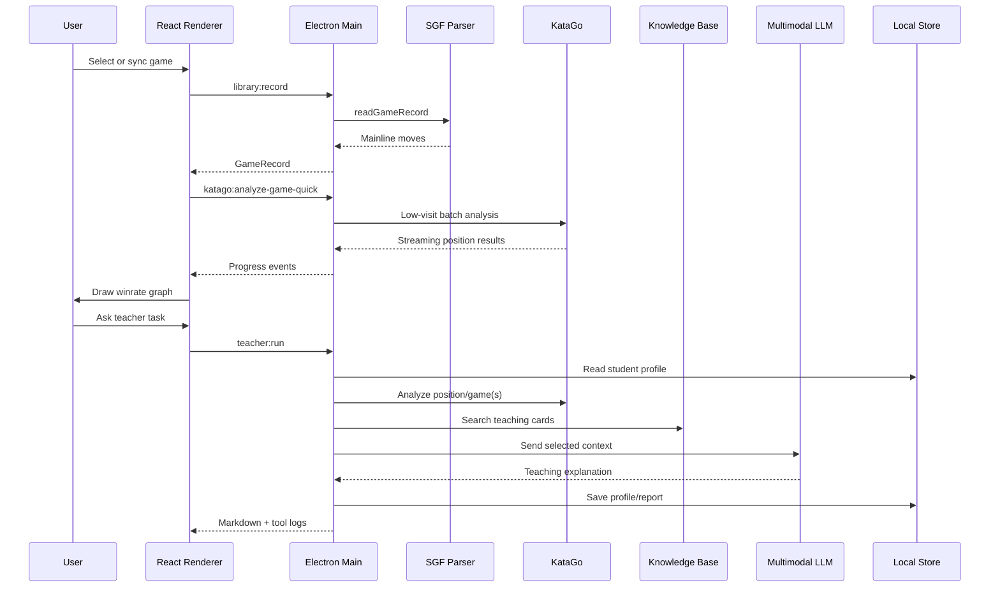

# Architecture

GoMentor is a local-first desktop workbench for Go education. It combines a professional board/review UI, KataGo analysis, a local knowledge base, and an agentic teacher runtime.

## Layers

```text
src/main
  Electron main process, local storage, Fox sync, SGF parsing,
  KataGo runtime resolution, teacher-agent tools, reports.

src/preload
  Typed IPC bridge exposed to the renderer.

src/renderer
  React workbench: library rail, board workspace, winrate graph,
  teacher chat, settings drawer.

data/knowledge
  Packaged teaching cards used for retrieval-augmented explanations.

data/katago
  Optional bundled KataGo binary/model layout. Large files are not committed.

scripts
  Batch review and local setup helpers.
```

## Runtime Flow



## Teacher Agent Runtime

The right-side teacher is intentionally not a static chat panel. Fast buttons call the same runtime that free-form prompts use.

Fast paths:

- Current move: board screenshot + KataGo position + knowledge cards + multimodal LLM.
- Full game: current SGF + KataGo batch review + knowledge cards + teacher summary.
- Recent 10 games: library filter + batch analysis + student profile update + teacher summary.
- Training plan: student profile + knowledge retrieval + teacher planning.

Open-ended path:

- Reads current SGF context when available.
- Reads student profile.
- Searches local knowledge.
- Optionally performs generic web search when requested.
- Can detect and update local KataGo configuration.
- Gives the LLM the tool catalog and collected context.

See [TEACHER_AGENT.md](./TEACHER_AGENT.md).

## Data Storage

Default local home:

```text
~/.gomentor/
  library/           Imported and synced SGFs
  reports/           Scripted review reports
  teacher-reports/   Agent-generated reports
  profiles/          Student profile JSON
  katago/            Generated analysis config and logs
```

LLM API keys are stored through Electron `safeStorage` when available. The renderer only receives whether an API key exists.

## KataGo Runtime Resolution

`src/main/services/katagoRuntime.ts` resolves runtime assets in this order:

1. Bundled `data/katago` runtime inside the app/resources.
2. User-managed `~/.gomentor/katago`.
3. System-installed `katago`.
4. Development fallback models such as `~/.katago/models/latest-kata1.bin.gz`.

The analysis config is generated in the user data directory so the external KataGo process can read it outside Electron's asar archive.

## Privacy Boundaries

- Local SGFs and student profiles stay on disk by default.
- Current-move multimodal analysis sends only board PNG, structured KataGo facts, selected knowledge cards, and the user prompt to the configured LLM endpoint.
- Batch review disables per-game LLM calls and summarizes the aggregate.
- Web search receives generic Go topic queries only.
- File-opening IPC is constrained to GoMentor-managed directories.

## Verification Baseline

```bash
pnpm typecheck
pnpm build
```

Release packaging is handled by `.github/workflows/release.yml` and `electron-builder`.
